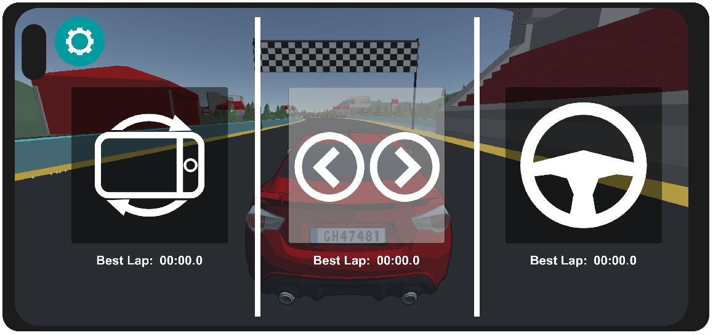

# HCI_project

3D racing game for smartphones to evaluate different interaction methods.

## To run:

- Clone repository
- Open ProjectTrackDay folder as Unity project
- Switch to android platform from project settings
- Connect smartphone to PC using unity remote

Note: First time opening the project could take up to 5 minutes due to the creation of the Library folder
